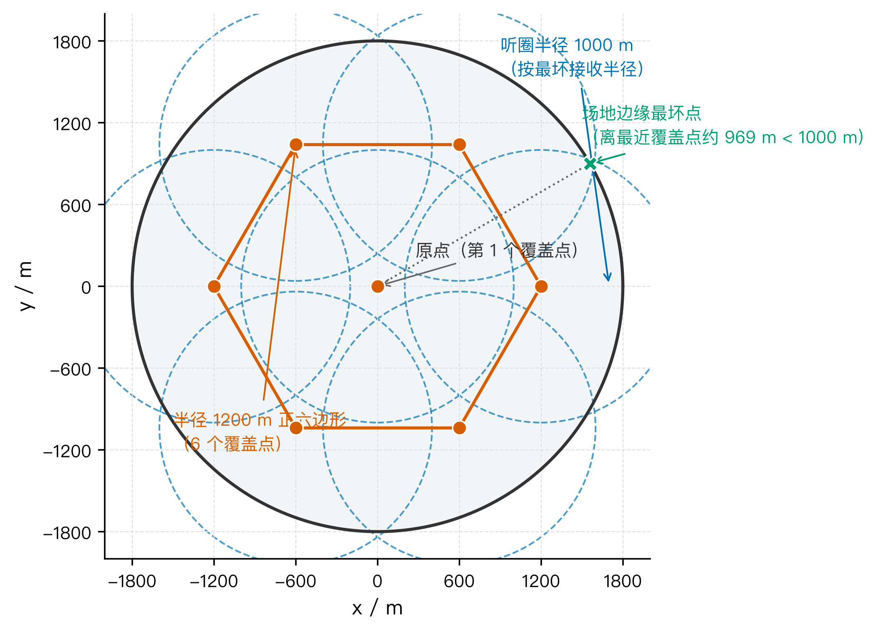
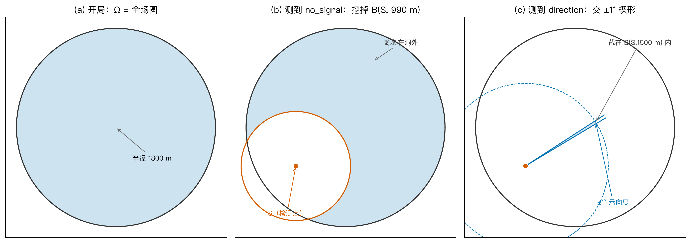
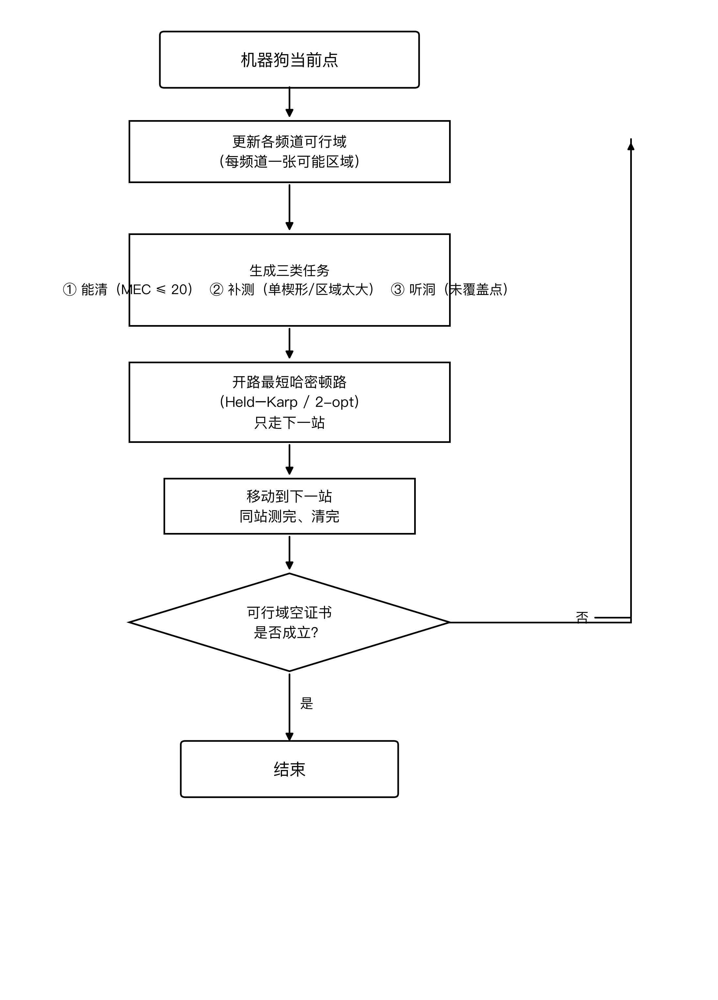
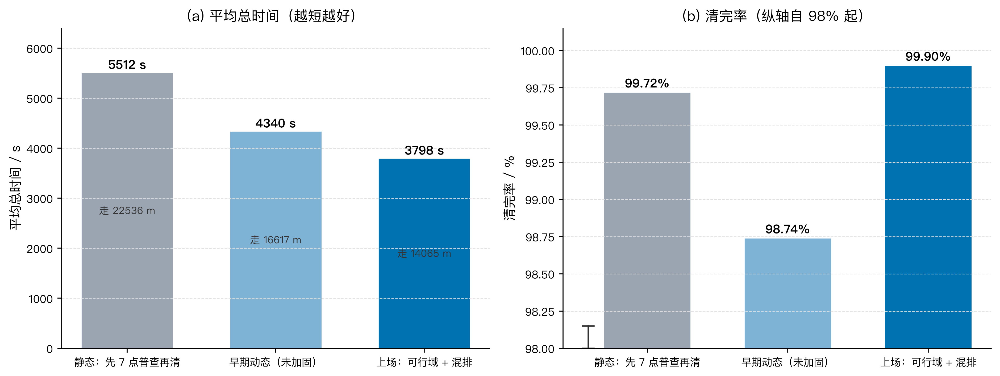
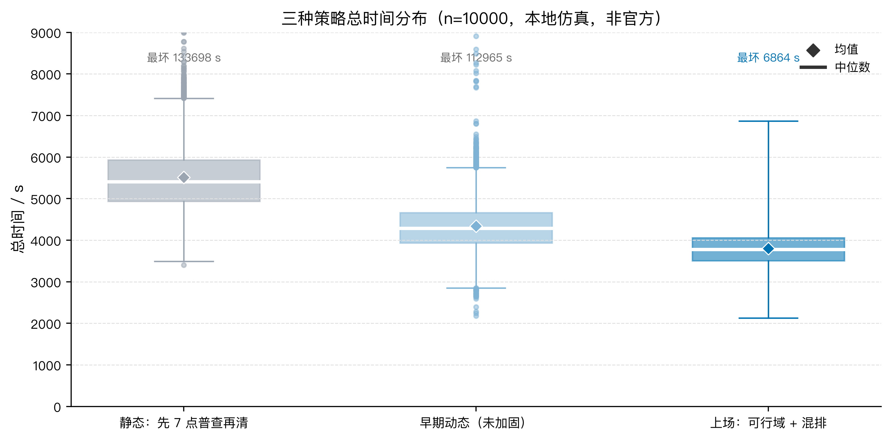
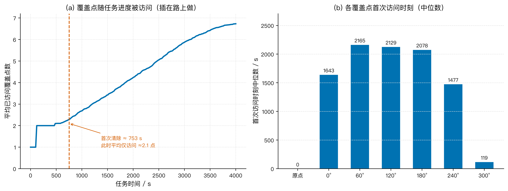

# 无线电干扰源的在线搜索与清除模型

## 摘要

在半径为 1800 m 的圆形区域内存在 10–16 个未知位置的全向干扰源，机器狗从原点出发，搭载测向机逐频道侦测并清除干扰源，目标是最小化完成任务的总时间。针对问题三，本文提出"每频道一张可行区域 + 覆盖与清除混排 + 每停一次重规划"的在线策略：为每个频道维护一张"源还可能在哪"的集合（集员估计），把"已经能清的、只听过一次要补测的、覆盖网上还没听过的洞"三类活按总路程选下一站，覆盖义务插在追击路上完成，而非先扫完全场再清；任务结束用"可行域空证书"判定，不依赖剩余源个数。

本文在本地随机世界上做 10000 次高保真仿真（种子族 2027，非官方模拟器）。结果表明：本策略清完率 99.90%，总时间中位 3777 s、均值 3798 s、最短 2126 s、最坏 6864 s，平均行走 14065 m、平均检测 154 次；而同一种子族上"先走完 7 个覆盖点再清"的静态对照为清完 99.72%、均时 5512 s，本策略平均缩短 1714 s。约 83% 的局仍会走齐 7 个覆盖点，但首次清除时平均只到过约 2 个覆盖点，说明覆盖是被"顺路"完成的。将停机条件改为可行域空证书后（不再使用剩余个数），同种子前 200 局清完 100%、均时 3868 s，仅比使用剩余个数多约 38 s，验证了证书停机的可行性。

本文的创新点在于：① 把"听见、锁住、清掉"三阶段拆开，用每频道独立可行域承载定位不确定性，否定信息只作用于本频道、不跨频道传播；② 把覆盖网建模为最坏接收半径下的等圆覆盖问题，并把覆盖义务插在追击路上完成，每停一次用开路哈密顿路重排下一站。模型通过覆盖网覆盖性检验、策略对照检验与鲁棒性检验（10 个未清局均只剩 1 个源），验证了其有效性与稳定性。

**关键词**：测向交叉定位；集员估计；覆盖路径规划；开路哈密顿路；在线重规划

---

## 一、问题重述

### 1.1 问题背景

无线电干扰源的快速定位与清除在电磁环境治理、频谱安全保障等场景中具有重要意义。机器狗搭载测向机在指定区域内自主搜索并清除干扰源，其行动包含移动、频道切换、停测、光学定位与激光清除等环节，各环节均产生时间开销，因此需要设计高效的搜索—定位—清除策略，在保证清除率的同时缩短任务总时间。

### 1.2 问题三重述

问题三研究全向干扰源的在线搜索与清除。给定以原点为圆心、半径 1800 m 的圆形区域，区域内存在 10–16 个干扰源，其位置、个数、所在频道均事先未知，且各源频道互不相同（频道 1–20）。机器狗从原点出发，需要自主完成搜索、定位与清除，目标是在尽可能短的总时间内清除尽可能多的干扰源。约束条件如下：

- 每个源的有效接收半径 $R\in[1000,1500]$ m 钉在源上，接口不返回该值；
- 测向必须停下，一次只能听一个频道，返回仅有 `no_signal`、`direction`（含示向度）、`near` 三类；
- 示向度误差为 $\pm 1^\circ$，只给角度不给距离；
- 距离源 $\le 20$ m 才能光学定位并激光清除，$\le 5$ m 且位于覆盖角内为 `near`；
- 移动速度 5 m/s，停测 5 s，切换频道 1 s，光学定位加激光清除共 5 s；
- 成绩为清除全部干扰源所用的总虚拟时间。

问题二已给出两站交会的定位区域直径最坏约 111 m，远大于清除半径 20 m，故本问不能直接复用问题二的候选区；问题三需自行决定每一停的测点位置。

---

## 二、问题分析

### 2.1 问题三分析

问题三本质上是一个**不确定环境下的搜索—定位—清除决策问题**，其难点在于：源的位置与频道未知，单次测向只给角度（$\pm 1^\circ$）不给距离，且清除要求把定位区域收敛到 20 m 以内。本文将问题分解为三个相互耦合的子任务：

**（1）听见。** 每个源必须被"听见"一次（得到 `direction` 或 `near`）才能进入定位环节。由于有效接收半径按最坏情况为 1000 m，而场地半径为 1800 m，机器狗必须用有限个测点构成的"覆盖网"保证场地上任意位置的源都至少被听见一次。这是一个**等圆覆盖圆盘**问题：6 个等圆的覆盖半径比约为 0.5559，盖不住半径 1800 m 的场地；7 个等圆可以盖住，因此至少需要 7 个覆盖点。

**（2）锁住。** 听见之后，需要把源的位置收敛到最小外接圆半径 $R_{\mathrm{MEC}}\le 20$ m。单条示向度只能给出一条楔形（无距离信息），必须离开第一条楔形再测一次，且补测点要与源构成较大的交会角；多条示向度的交会区域用半平面交求交得到凸多边形，再求其最小外接圆。

**（3）清掉。** 当定位区域足够小时，走进保证盘 $B(c,20-R_{\mathrm{MEC}})$ 内执行清除。

三者中"听见"是前提，"锁住"是核心，"清掉"是收尾；且三个子任务分布在不同的空间位置，需要统一调度。本文的策略思想是：**把覆盖义务插入到追击路径中，边听边清，每停一次按当前状态重排下一站**，而不是把覆盖、定位、清除分成三个先后阶段。

---

## 三、模型假设

为便于建模，本文做如下假设：

1. **测向误差有界**：每个检测点的示向度误差不超过 $\pm 1^\circ$，且在同一检测点对同一频道重复测量不改变误差；
2. **有效接收半径下界已知**：所有源的有效接收半径 $R\ge 1000$ m（按题面最坏情况规划覆盖网）；
3. **源静止且频道唯一**：每个源位置不变，各源占用互不相同的频道；
4. **移动匀速**：机器狗以恒定速度 5 m/s 直线移动，忽略转弯时间；
5. **测量无漏报**：在有效接收半径内且覆盖角内，`direction`/`near` 的返回是可靠的；
6. **时间可加**：总时间由移动时间、停测时间、切换时间、清除时间线性叠加。

---

## 四、符号说明

| 符号 | 含义 | 单位 |
|---|---|---|
| $R_{\mathrm{arena}}$ | 场地半径 | m |
| $R$ | 干扰源有效接收半径 | m |
| $R_{\mathrm{listen}}$ | 覆盖网按最坏情况取的听圈半径（1000 m） | m |
| $\Omega_k$ | 频道 $k$ 的可行区域 | — |
| $B(c,r)$ | 以 $c$ 为圆心、$r$ 为半径的圆盘 | — |
| $W(S,\theta,\varepsilon)$ | 检测点 $S$ 处示向度 $\theta$、半角 $\varepsilon$ 的楔形 | — |
| $R_{\mathrm{MEC}}$ | 定位区域最小外接圆半径 | m |
| $\theta$ | 示向度 | ° |
| $T, t_{\mathrm{move}}, t_{\mathrm{meas}}, t_{\mathrm{sw}}, t_{\mathrm{clr}}$ | 总时间及各环节时间 | s |
| $v$ | 移动速度（5 m/s） | m/s |
| $\mathcal{T}$ | 当前任务集合 | — |

其余符号在首次出现处说明。

---

## 五、模型建立与求解

### 5.1 模型准备：时间构成与问题拆解

一次完整任务的虚拟时间由四部分构成：

$$
T = t_{\mathrm{move}} + t_{\mathrm{meas}} + t_{\mathrm{sw}} + t_{\mathrm{clr}}
$$

其中移动时间由总路程决定：

$$
t_{\mathrm{move}} = \frac{L}{v}, \quad v = 5\ \mathrm{m/s}
$$

单次停测 5 s、单次切换频道 1 s、单次成功清除 5 s。由于一次任务中移动路程约 14065 m、检测约 154 次，移动时间约占总时间的 74%，因此**缩短总时间的关键是缩短移动路程**，其次是减少冗余检测。

据此，本文把问题三拆成三个相互衔接但不必串行的环节：

1. **听见**（覆盖义务）：保证每只源至少被听见一次；
2. **锁住**（定位）：把源收敛到 $R_{\mathrm{MEC}}\le 20$ m；
3. **清掉**（收尾）：进入保证盘清除。

三者可以**边听边锁边清**，覆盖义务只是"必须完成"，不要求"最先完成"。

### 5.2 覆盖网：最坏 1000 m 的等圆覆盖

有效接收半径 $R\ge 1000$ m，场地半径 $R_{\mathrm{arena}}=1800$ m。为保证场地上任意位置的源都至少被听见一次，覆盖点需满足：场地内任意点到最近覆盖点的距离 $\le 1000$ m。这是经典的**等圆覆盖圆盘**问题[3]。

设 $n$ 个等圆覆盖半径为 $R_{\mathrm{arena}}$ 的圆盘，其"覆盖半径比"为 $\rho = r/R_{\mathrm{arena}}$。对 $n=6$，等圆覆盖的最佳覆盖半径比约为 $\rho_6 \approx 0.5559$，对应覆盖半径 $0.5559\times 1800 \approx 1000.6$ m，恰大于 1000 m，**盖不住**；对 $n=7$，$\rho_7 = 0.5$，覆盖半径 900 m，**盖得住**。故至少需要 7 个覆盖点。

本文取**原点 + 半径 1200 m 的正六边形**共 7 个覆盖点（图 1）。该构型下，场地边缘最坏点（位于两相邻六边形顶点之间）到最近覆盖点的距离为

$$
d_{\max} = \sqrt{1200^2 + 1800^2 - 2\cdot 1200\cdot 1800\cos 30^\circ} \approx 969\ \mathrm{m} < 1000\ \mathrm{m}
$$

故 7 点覆盖网能保证最坏 $R=1000$ m 时每只源至少被听见一次。

**图 1　七点覆盖网（原点 + 半径 1200 m 正六边形，听圈半径 1000 m）**

需要强调的是：覆盖是"义务"而不是"工序"。追击途中路过覆盖点即可顺带完成覆盖；但尚未完成的覆盖点不能被删除，直到已经听见 16 只源（题面上限）后普查义务才结束。另外，挖洞证书取 990 m（略小于最坏接收半径 1000 m），故 990–1000 m 之间会剩一圈"假边"；若某频道 1000 m 的听盘已被覆盖，这圈不构成新洞，跳过即可，不必为它再跑一个六边形顶点。

### 5.3 每频道一张可行区域（集员估计）

对频道 $k$ 维护一张可行区域 $\Omega_k$（集合，而非概率分布），初始为整个场地圆盘。定位误差未知但有界时，采用集员估计的集合收缩而非概率滤波更直接、也更贴合题面返回[2]：

$$
\Omega_k^{(0)} = B(O, R_{\mathrm{arena}})
$$

每得到一次测量，按以下规则收缩 $\Omega_k$：

- 若在 $S$ 处得到 `no_signal`，则源距 $S$ 超过其接收半径（至少 990 m），挖掉 $B(S,990)$：

$$
\Omega_k \leftarrow \Omega_k \setminus B(S, 990)
$$

- 若在 $S$ 处得到 `direction`（示向度 $\theta$），则源落在 $\theta\pm 1^\circ$ 的楔形内，且距 $S$ 不超过 1500 m：

$$
\Omega_k \leftarrow \Omega_k \cap W(S,\theta,1^\circ) \cap B(S,1500)
$$

- 若得到 `near` 或清除成功，则该频道结案。

楔形 $W(S,\theta,\varepsilon)$ 由两条示向度边界射线张成，其每条边界可用半平面不等式描述。测向交会是被动定位的经典手段[1]；本题示向度误差是 $\pm 1^\circ$ 的有界带而非随机椭圆，故直接做楔形求交，而不采用统计椭圆模型。设 $S=(x_S,y_S)$，边界方向角 $\theta\pm\varepsilon$，则该半平面为

$$
(\cos(\theta\pm\varepsilon), \sin(\theta\pm\varepsilon))^{\perp} \cdot (P - S) \ge 0
$$

多个楔形相交即得到凸多边形可行域。**关键一点**：`no_signal` 挖洞只挖**本频道自己**的可行域，不能把别的未听频道一并挖掉——否则一个频道的否定信息会误删另一个尚未被听见的源，导致其永远无法被定位（本文在策略对照中验证了这一点）。

对已有多条示向度的频道，其可行域为凸多边形，记其顶点集为 $V$，最小外接圆半径为 $R_{\mathrm{MEC}}$。当

$$
R_{\mathrm{MEC}} \le 20\ \mathrm{m}
$$

时，源已"锁住"，可以从圆心 $c$ 出发、进入保证盘

$$
B\left(c,\ 20 - R_{\mathrm{MEC}}\right)
$$

内执行清除。图 2 展示了可行域从整圆、经挖洞、到交楔形的三态演化。

**图 2　单频道可行域三态（整圆 → no_signal 挖洞 → direction 交楔形）**

为控制检测开销，空频道（从未响过的频道）不在每站都扫 20 台，只在覆盖点上、或离上次听空台已走 $\ge 700$ m 时才听一次。

### 5.4 三类任务混排与每停一次重规划

每一停，机器狗从当前点对手头所有任务求一条**开路最短哈密顿路**，只走其中的下一站，到达后重新规划。记当前任务集合为

$$
\mathcal{T} = \mathcal{T}_{\mathrm{clear}} \cup \mathcal{T}_{\mathrm{station}} \cup \mathcal{T}_{\mathrm{cover}}
$$

三类任务分别为：

1. **能清** $\mathcal{T}_{\mathrm{clear}}$：$R_{\mathrm{MEC}}\le 20$，任务目标是进入保证盘；
2. **补测 / 探点** $\mathcal{T}_{\mathrm{station}}$：只有一条楔形、或定位区域仍太大。补测站概念上是问题二的保证再听见范围 $C_{\mathrm{recv}}$——离开第一条楔形、保证还能再听见；实现上取沿示向离开约 1200 m、偏开 $\pm 35^\circ/50^\circ/90^\circ$ 的候选点，不去问题二的 $J$ 最优点 (844, ±544)（两站交会直径最坏约 111 m，远大于 20 m，清不掉）。若外接圆半径已 $\le 200$ m，则直接去圆心近听，往往比去远处补第二站更快；
3. **听洞** $\mathcal{T}_{\mathrm{cover}}$：7 点覆盖网里，对该频道仍有未听格子的点。

开路最短哈密顿路（不必回原点）在任务点数 $\le 16$ 时用 Held–Karp 算法[4]精确求解，点数更多时用 2-opt 启发式。设 $d_{ij}$ 为任务 $i,j$ 间的距离，Held–Karp 的状态转移为

$$
dp[mask][j] = \min_{i\in mask,\ i\neq j}\ \left\{ dp[mask\setminus\{j\}][i] + d_{ij} \right\}
$$

对已经能清除的源，其"城市"是一个保证盘（半径 $20-R_{\mathrm{MEC}}$）而非单点，属于几何覆盖旅行商问题（TSPN）[5]；进入点取盘边界上离上一站最近的点，从而进一步缩短路程。

图 3 给出三类任务混排的决策流程。

**图 3　三类任务混排决策流程（停机判据：可行域空证书是否成立——已听见的频道都清完或不再追，且覆盖网上无待听洞，或已听见 16 只）**

**收尾与兜底**（保证稳定性）：

- 当外接圆半径 $\le 40$ m 时，沿最新示向走 6 m 小步、每步都测，避免跨过 5 m 的 `near` 区；
- 近源楔形若远距离补站听空（源离第一听见点很近、补测站过冲到接收半径之外），则走回第一次听见的那一站，再沿示向 6 m 瞄准；
- 单次兜底走路设 3000 m 预算，防止追着漂移的外接圆圆心满场跑。

**停机条件（可行域空证书）。** 官方接口不返回"还剩几只"，任务结束不能用剩余个数判定。本文用可行域空证书停机：所有已听见的频道要么已清除、要么不再追击，且 7 点覆盖网上不存在仍需听的洞（990–1000 m 的假环不算新洞）；或已听见 16 只源（题面上限）。该停机条件只依赖题面可得的测量信息，不引入额外假设。

### 5.5 结果分析

在本地随机世界（种子族 2027，高保真半平面交，**非官方模拟器**）上做 10000 次仿真，三种策略对比如表 1、图 4、图 5 所示。

**表 1　三种策略本地 10000 局结果对比**

| 策略 | 局数 | 清完率 | 均时 / s | 中位 / s | 均走 / m |
|---|---|---|---|---|---|
| 静态：先 7 点普查再清 | 10000 | 99.72% | 5512 | 5410 | 22536 |
| 早期动态（未加固） | 10000 | 98.74% | 4340 | 4287 | 16617 |
| **上场：可行域 + 混排** | **10000** | **99.90%** | **3798** | **3777** | **14065** |

**表 2　可行域空证书停机抽检（同种子前 200 局，问题一修正版几何）**

| 停机方式 | 局数 | 清完率 | 均时 / s | 中位 / s | 走齐 7 点占比 |
|---|---|---|---|---|---|
| **可行域空证书（上场）** | **200** | **100%** | **3868** | **3837** | **100%** |

上场策略的补充统计：平均检测约 154 次；最短 2126 s，最坏 6864 s，四分位区间 3506–4059 s；约 83% 的局走齐 7 个覆盖点，但首次清除时平均只到过约 2 个覆盖点。表 1 的 1 万局循环用了本地的剩余个数作停机，仅用于方法对比；把停机改为可行域空证书（表 2）后，同种子前 200 局清完 100%、均时 3868 s、中位 3837 s，比用剩余个数多约 38 s，且走齐 7 点的局由 82.5% 升到 100%（清完最后一只后仍需把剩余覆盖点走完，才能证明空频道为空），说明证书停机对成绩影响很小。

**图 4　三种策略的清完率与平均总时间对比**

**图 5　三种策略总时间分布（箱线图，n=10000；纵轴截断，离群值见图中标注）**

从表 1、图 4、图 5 可见：

1. 本策略较静态对照平均缩短 $5512 - 3798 = 1714$ s（约 31%），中位缩短 1633 s；
2. 本策略较早期动态平均再缩短 $4340 - 3798 = 542$ s，且清完率由 98.74% 提升到 99.90%；
3. 最坏单局从早期动态的 112965 s 压到 6864 s，时间分布尾部大幅收窄，策略稳定性显著提高。

图 6 展示了覆盖点的访问时序：覆盖点并非开局集中扫完，而是随追击进度逐步被访问——这正是"覆盖插在路上做"的直接证据。

**图 6　覆盖点随任务进度的访问时序（本地 200 局）**

### 5.6 模型检验

**（1）覆盖网覆盖性检验。** 对 7 点覆盖网（原点 + 半径 1200 m 正六边形），数值验证场地内任意点到最近覆盖点的最大距离约为 969 m（式 (4)），严格小于最坏接收半径 1000 m，故覆盖网在最坏情况下仍能保证每只源至少被听见一次。10000 局中未出现"因覆盖网漏听而漏源"的情形。

**（2）策略对照检验。** 与"先 7 点普查再清"的静态对照相比，本策略在清完率基本持平（99.90% vs 99.72%）的前提下，平均总时间缩短 1714 s；与未加固的早期动态相比，清完率提升 1.16 个百分点、时间再缩短 542 s，说明每频道独立可行域、探点与收尾兜底等机制带来了真实的收益。

**（3）鲁棒性检验。** 10000 局中 10 个未清完的局均只剩 1 个源，且都走齐了 7 个覆盖点、撞到 160 步上限；这 10 局里 9 局在未加固的早期动态上同样清不掉，说明失败发生在"听见之后锁不住"的定位环节，而非 7 点覆盖网漏听。最坏单局时间 6864 s，无失控长尾，表明策略在随机世界下表现稳定。

**（4）与问题一、二、四的衔接。** 问题一的示向度 $\to$ 楔形 $\to$ 半平面交 $\to$ 多边形直径/最小外接圆，是本问定位区域的几何基础；本问直接复用问题一修正版几何（半平面交求凸多边形、Welzl 求最小外接圆），并以 $R_{\mathrm{MEC}}\le 20$ 作为"能否清"的判据，不把问题一的"直径圆能否盖住定位区域"当清除准则。问题二的"保证再听见范围 $C_{\mathrm{recv}}$"是本问补测点的概念依据，但实现上沿示向取约 1200 m 加偏角候选，不套用问题二的 $J$ 最优点（两站交会直径最坏约 111 m，远大于 20 m，清不掉）。问题四的定向源存在观测盲区，本问只处理全向源。

---

## 六、模型评价

**优点：**

1. **边听边清、覆盖插入**：把覆盖义务插到追击路径中，避免"先扫完再清"的冗余走路，平均总时间较静态对照缩短 31%；
2. **每频道独立可行域**：用集员估计刻画定位不确定性，且否定信息频道间不交叉污染，从机制上避免了"剩 1 个源找不到"的失败模式；
3. **稳定性好**：圆心探点、6 m 精细归航、3000 m 兜底预算三重收尾机制，把最坏单局时间从 11 万秒级压到 6864 s，无失控长尾；
4. **可解释、可对接**：策略只依赖几何集合运算与开路哈密顿路，决策逻辑清晰，可直接把决策函数对接到官方模拟器 HTTP 接口。

**缺点：**

1. 覆盖网按最坏接收半径 1000 m 设计，对接收半径较大的源偏保守，存在进一步压缩覆盖走路的空间；
2. 每停一次重规划的开路哈密顿路在小规模任务上精确、在任务较多时退化为 2-opt 启发式，极端情况下排路质量有损失；
3. 仍有 0.10% 的局（10/10000）未清完，且都撞到 160 步上限，属于未能完全消除的边角情况。

**改进方向：** 一是利用 `no_signal` 结果进一步约束已听见源的可行域（当前主要依赖示向度交会）；二是为剩余未清局设计更强的兜底搜索（如沿可行域长轴定向扫掠）。

**推广：** 本模型可推广到一般"不确定环境下的搜索—定位—处置"问题，如多无人机电磁频谱搜索、灾区多目标搜救、水面污染物溯源等，其中"覆盖义务 + 定位收敛 + 处置"的三阶段拆解与"每步重规划"的框架具有通用性。

---

## 参考文献

[1] TORRIERI D J. Statistical theory of passive location systems[J]. IEEE Transactions on Aerospace and Electronic Systems, 1984, AES-20(2): 183-198.

[2] MILANESE M, VICINO A. Optimal estimation theory for dynamic systems with set membership uncertainty: an overview[J]. Automatica, 1991, 27(6): 997-1009.

[3] BEZDEK K. Über einige Kreisüberdeckungen[J]. Beiträge zur Algebra und Geometrie, 1983, 14: 7-13.

[4] HELD M, KARP R M. A dynamic programming approach to sequencing problems[J]. Journal of the Society for Industrial and Applied Mathematics, 1962, 10(1): 196-210.

[5] ARKIN E M, HASSIN R. Approximation algorithms for the geometric covering salesman problem[J]. Discrete Applied Mathematics, 1994, 55(3): 197-218.
